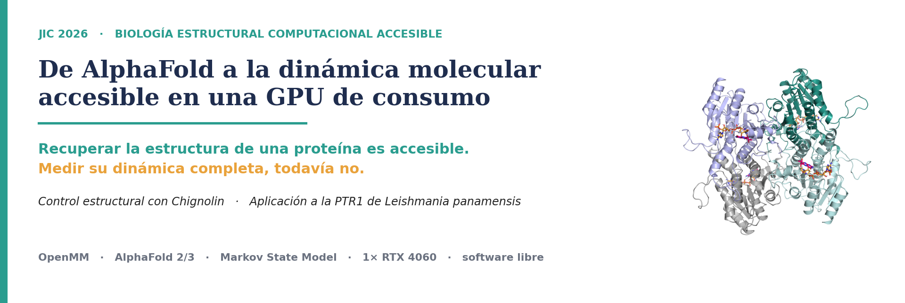
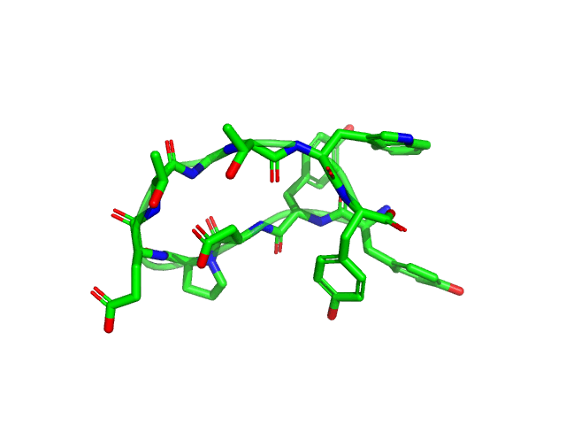
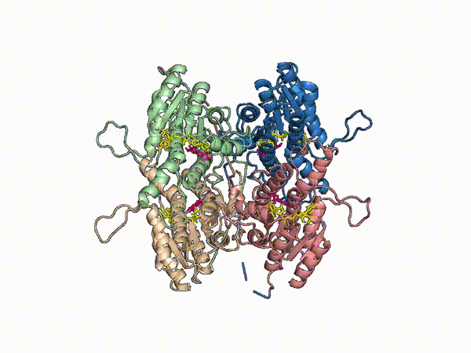

> **Una GPU de consumo basta para recuperar la _estructura_ de una proteína; medir su _dinámica_ completa, todavía no.**

¿Qué biología estructural puede hacer una universidad con **una sola tarjeta gráfica de
consumo**, sin un centro de supercómputo? Este proyecto de la **Jornada de Iniciación
Científica (JIC) 2026** lo pone a prueba: usa **dinámica molecular (MD)** en una **GPU
NVIDIA RTX 4060** con software libre para ver hasta dónde llega un flujo abierto y
reproducible de biología estructural computacional con recursos accesibles, y lo contrasta
con la predicción estructural de **AlphaFold 2 y 3**. Primero lo **calibra** con Chignolin
(una mini-proteína de plegamiento conocido) y luego lo **aplica** a la **PTR1 de
_Leishmania panamensis_**, una enzima clave del parásito —sin equivalente directo en
humano— cuya estructura aún no se ha determinado experimentalmente.

---

## ✨ Lo que logramos

|  |  |
|---:|:---|
| **0.15 Å** | RMSD mínimo de Chignolin recuperado por MD — a la par de AlphaFold2 (**0.90 Å**) y del experimento |
| **100 ns** | tetrámero holo de PTR1 **estable**, con ligandos retenidos y el sitio activo intacto |
| **83–100 %** | conservación de la tríada catalítica Ser111–Tyr193–Lys197 en los **4 protómeros** |
| **< 1 Å** | **convergencia de cuatro vías independientes**: cristal 1E92 · modelo por homología · MD · AlphaFold3 |
| **1× RTX 4060** | todo el estudio en una GPU de consumo (~US$300), con **100 % software libre** |

En corto: con recursos al alcance de un estudiante se obtienen **modelos estructurales
útiles y auditables**. La accesibilidad no es una limitación del trabajo — es su tesis.

---

## 🎬 Animaciones de las simulaciones (`media/`)

| Chignolin — plegada (MD) | PTR1 — tetrámero holo, 100 ns (MD) |
|:---:|:---:|
|  |  |

_También en `.mp4` (mayor calidad)._

---

## 🧬 Modelos de AlphaFold (`alphafold/`)

El proyecto contrasta la MD con dos generaciones de predicción estructural:

**AlphaFold2 — Chignolin** · `alphafold/chignolin_af2/` (vía [ColabFold](https://github.com/sokrypton/ColabFold))
- 5 modelos `.pdb` + sus `scores`. pLDDT ≈ 94; **RMSD 0.90 Å** frente a la estructura experimental.

**AlphaFold3 — PTR1, tetrámero holo con NADPH** · `alphafold/ptr1_af3/` (vía [AlphaFold Server](https://alphafoldserver.com/))
- 5 modelos `.cif` + `summary_confidences`. **pTM / ipTM = 0.95.**
- AF3 vs nuestro modelo de MD: **0.73 Å** · AF3 vs cristal **1E92**: **0.28 Å**.
- ⚠️ **Lectura honesta:** AF3 usó **cuatro cristales de PTR1 como plantilla** (1E92, 2XOX,
  1P33, 1E7W — incluidos en `ptr1_af3/templates/`). Por eso cuenta como **chequeo de
  consistencia / triangulación**, no como validación ciega. Análisis completo en
  [`ptr1_af3/RESULTADO_AF3.md`](alphafold/ptr1_af3/RESULTADO_AF3.md).

Referencias: AlphaFold2 — Jumper et al., _Nature_ 2021 · AlphaFold3 — Abramson et al.,
_Nature_ 2024 · ColabFold — Mirdita et al., _Nat. Methods_ 2022.

---

## 🎯 Qué concluye — y qué no

Honestidad de entrada: el valor del trabajo está tanto en lo que demuestra como en el
cuidado con que delimita lo que **no** afirma.

| ✅ Lo que el trabajo **sí** muestra | 🚧 Lo que el trabajo **no** afirma |
|---|---|
| La estructura de Chignolin se recupera a **0.15 Å**, a la par de AlphaFold2 | Que se mida la **cinética** de plegamiento (exige microsegundos) |
| Un modelo de PTR1 **estable 100 ns**, con el sitio activo intacto | Que el modelo **reemplace** una estructura experimental |
| **Convergencia** de 4 vías independientes a < 1 Å | Que AF3 sea **validación ciega** (usó cristales como plantilla) |
| Un pipeline **abierto y reproducible** en 1 GPU de consumo | **Actividad** catalítica: «geometría compatible» ≠ actividad |
| La Tyr114 como **posible** contacto de especie (preliminar) | **Epistasis** ni un rasgo determinante (una sola réplica) |
| Una base metodológica para enfermedades desatendidas | Un **fármaco** ni cribado virtual (eso es trabajo futuro) |

---

## 🔬 Resultados en detalle

**Chignolin — calibración del método**
- 450 ns de MD a 340 K. **RMSD mínimo 0.15 Å** vs experimental (mediana ~0.91 Å);
  **AlphaFold2 0.90 Å**, pLDDT ~94.
- A 340 K la proteína quedó **~99.5 % plegada**: no se observó suficiente
  desplegado/replegado para medir la cinética, y el MFPT del MSM **no** representa la
  velocidad real de plegamiento. Es, justamente, el límite que el proyecto cuantifica.

**PTR1 de _L. panamensis_ — aplicación**
- Modelo por homología: monómero de AlphaFold DB → **tetrámero holo** sobre el cristal
  **1E92** (_L. major_, 73.9 % de identidad) + NADPH + sustrato. **114 856 átomos**.
- **100 ns** estables (RMSD Cα ≈ 2.0 Å); ligandos retenidos; **tríada catalítica
  conservada 83–100 %** en los cuatro sitios; distancia de hidruro **≈ 3.8–4.0 Å**
  («geometría compatible con la catálisis», _no_ actividad).
- **Convergencia estructural** (no validación ciega): MD vs 1E92 **1.05 Å**; AF3 vs MD
  0.73 Å y AF3 vs 1E92 0.28 Å — cuatro caminos a < 1 Å (ver sección AlphaFold).
- La Tyr114 de _L. panamensis_ (sustitución F114Y respecto a _L. major_) parece formar un
  **contacto polar accesorio** con el sustrato; controles _in silico_ (30 ns) lo señalan
  como **accesorio, no esencial**. Es resultado de **una sola réplica** → preliminar.

Resumen tabulado de métricas y caveats en [`docs/results_summary.md`](docs/results_summary.md).

## ⚖️ Alcance honesto

Los límites se declaran de frente — son parte del rigor, no una nota al pie:
**una réplica por condición** (sin estadística entre réplicas); **MD clásica** (no modela
la reacción química); **modelo por homología** (no una estructura nueva); Chignolin queda
**sobre-estabilizada** a 340 K con este campo de fuerza; y el **cribado virtual** queda
**fuera del alcance**, como trabajo futuro.

---

## 🌍 ¿Para qué sirve esto?

Es un trabajo **metodológico y demostrativo**: el valor está en el _enfoque_, no en un
hallazgo clínico. El mismo flujo —abierto, reproducible y de bajo costo— puede servir para:

- **Democratizar la biología estructural computacional**: hacer MD seria con una GPU de
  consumo, sin necesidad de un centro de supercómputo.
- **Enfermedades desatendidas de la región** (leishmaniasis, Chagas, malaria): caracterizar
  la estabilidad y la flexibilidad de sus proteínas blanco como **punto de partida**, sobre
  todo cuando aún no existe una estructura experimental.
- **Base para trabajo futuro** (por ejemplo, cribado virtual o diseño de variantes), que
  **no formó parte de este estudio**.
- **Plantilla reproducible** que otros estudiantes y laboratorios pueden adaptar a sus
  propias proteínas.

> Este proyecto **no** propone un fármaco ni un tratamiento; ofrece un método accesible y
> honesto para **empezar** a estudiar estos sistemas.

---

## 📁 Estructura del repositorio

```
.
├── chignolin/          # Calibración (pipeline reproducible, config-driven): prep → muestreo → análisis → MSM
├── ptr1/               # Aplicación: PTR1 de L. panamensis (construcción, MD, mutantes, análisis)
├── alphafold/          # chignolin_af2/ (ColabFold) · ptr1_af3/ (AlphaFold Server + plantillas)
├── media/              # Animaciones de las trayectorias (mp4 + gif)
├── paper/              # Artículo divulgativo JIC (versión ciega, PDF)
├── figures/            # Figuras científicas 300 dpi (ver figures/README.md)
├── docs/               # results_summary.md (métricas) · reproducibility.md (cómo correr)
├── assets/             # banner del repositorio
├── environment.yml · LICENSE (MIT) · LICENSE-figures (CC-BY-4.0)
```

## ⚙️ Reproducir (resumen)

```bash
conda env create -f environment.yml && conda activate jic-folding
cd chignolin && bash scripts/download_structure.sh
python src/prepare_system.py && python src/adaptive_sampling.py
python src/analysis_rmsd.py && python src/build_msm.py
```

Pasos completos, dependencias y datos no incluidos en
[`docs/reproducibility.md`](docs/reproducibility.md). El módulo de PTR1 requiere además
**AmberTools** (parametrización de NADPH/HBI) y **PyMOL** (renders).

## 🧰 Stack

OpenMM · AMBER ff14SB / GAFF2 · TIP3P · AlphaFold2 (ColabFold) · AlphaFold3 (AlphaFold Server)
· deeptime (MSM) · mdtraj · PyMOL · AmberTools · GPU NVIDIA RTX 4060.

## 📄 Licencia y cómo citar

Código bajo [MIT](LICENSE); figuras y animaciones bajo [CC-BY-4.0](LICENSE-figures).
Para citar, ver [`CITATION.cff`](CITATION.cff) y el artículo del proyecto en `paper/`
(Jornada de Iniciación Científica 2026, en evaluación).
